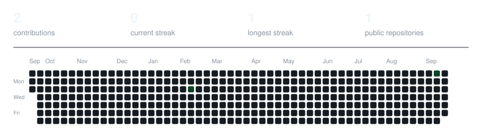

# Marcos

**Software Developer · 22 years old**

Building desktop, backend and realtime software with a focus on performance, reliability and thoughtful engineering.

 

## About me

I'm **Marcos**, a 22-year-old software developer who likes understanding how products work end to end — from native desktop code and networking to backend services and interfaces.

I care about **performance, architecture, security and user experience**, and I enjoy turning complex technical problems into software that feels simple and reliable to use.

- Building desktop applications, backend services and realtime systems
- Working with bots, automation, networking and media
- Always learning more about systems programming and software architecture

 

## Languages & technologies

<h3>Languages</h3>

<h3>Desktop & Runtime</h3>

<h3>Frontend & Backend</h3>

<h3>Infrastructure & Tools</h3>

  

Also working with <strong>WebRTC</strong>, <strong>WebSockets</strong> and <strong>Discord.js</strong>.

 

## What I enjoy building

Desktop applications · Backend systems · Realtime communication · Bots & automation

Networking · Developer tools · Voice & video · Performance engineering

 

## GitHub activity

 

---

<strong>@1blayze</strong> · Building software with curiosity, precision and care.

